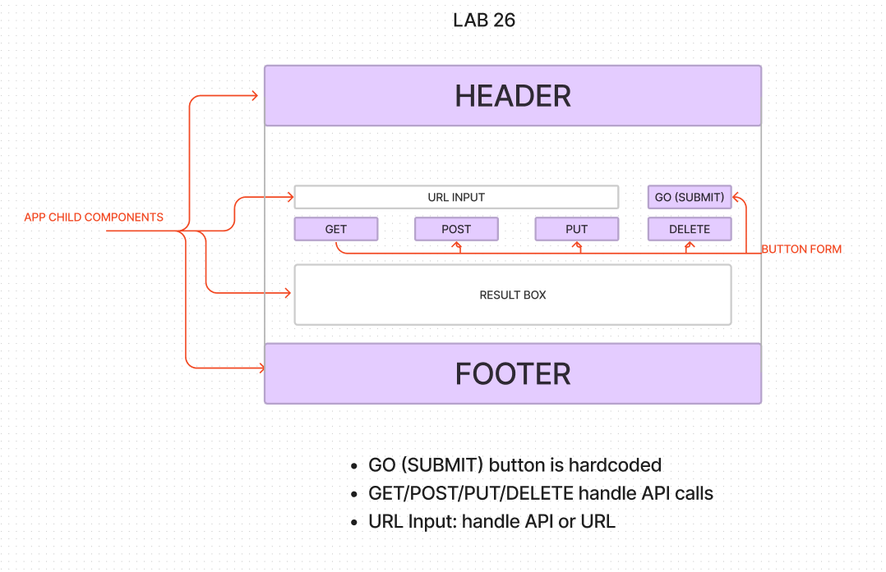

# LAB 

### Author: Timothee Odushina

## Class 26 

### Phase 1 Requirements

Today, we begin the first of a 4-Phase build of the RESTy application, written in React. In this first phase, our goal is to setup the basic scaffolding of the application, with intent being to add more functionality to the system as we go. This initial build sets up the file structure so that we can progressively build this application in a scalable manner.

## Class 27

### Phase 2 Requirements

In phase 2, we will be receiving user input in preparation of connecting to live APIs, using the useState() hook in our functional components. In order to properly manage state with the useState hook, we will now convert App.js to a functional component.

## Class 28

### Phase 3 Requirements

In phase 3, we will be connecting RESTy to live APIs, fetching and displaying remote data. Our primary focus will be to service GET requests

## Class 29

### Phase 4 Requirements

In phase 4, we will be tracking every API call and storing it in history

## UML

## Setup

* npx create-react-app
* npm i react react-dom react-jsonschema-form react-router-dom react-scripts sass

## How to initialize/run your application (where applicable)

* `npm start`